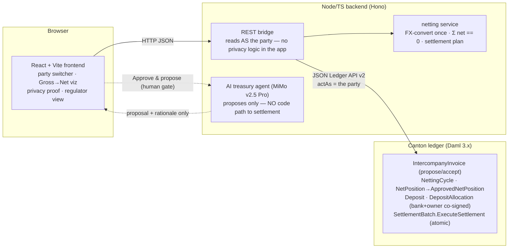

# AtomicNet

[](https://github.com/OoJae/AtomicNet/actions/workflows/ci.yml)

**Private, atomic, cross-currency intercompany settlement on Canton — with an AI treasury agent that proposes but never settles.**

AtomicNet lets the subsidiaries of a multinational settle their intercompany invoices by *netting* — collapsing a tangled web of gross cross-currency payments into one net payment per entity — where (a) no subsidiary can see another's bilateral balances, and (b) the net settlement executes **atomically** against tokenized bank deposits. In the demo dataset, **20 gross invoices across 3 currencies collapse into 3 net payments**, and one entity (Sub_SG) nets to exactly zero — it owed as much as it was owed, so **no money moves for it at all**.

> Hackathon project — Build on Canton (Encode Club × Canton Foundation, 2026). MVP scope: 5 subsidiaries, 1 operator, 1 bank, 1 regulator; 3 currencies; hosted demo environment (not mainnet).

**🌐 Live demos:**
- **On Canton DevNet (the real network): https://atomicnet-devnet-production.up.railway.app** — the app connected to the hackathon's shared DevNet validator; the settled 20→3 cycle you see is real on-ledger state. (Note: actions here are real network transactions — the full demo cycle takes ~7 minutes to settle.)
- **Sandbox playground: https://atomicnet-production.up.railway.app** — the same app on a self-contained Canton ledger (fast, reseeds on restart) for freely clicking through the full flow.

Try, in order: **Network** tab → toggle *Gross web ↔ Net settlement* → switch *Acting as* → **UK** → **Privacy Proof** (most invoices are simply *not there* — hidden by the ledger, not the app) → **Regulator** (sees the netting & settlement trail) → **Operator** → *▷ Run full demo cycle* (instant on the sandbox; real settlement latency on DevNet).

## Why this is impossible anywhere but Canton

Multilateral netting needs two properties **simultaneously**:

1. **Confidentiality between participants.** Subsidiary B must not see the A↔C invoice flow. On a transparent chain (Ethereum & co.) the whole netting graph is public. On Canton, a party learns of a contract *only* if it is a signatory, observer, or controller — there is no global broadcast. We never filter data in the app; we query the ledger **as the logged-in party** and the protocol does the rest.
2. **Atomic multi-party settlement.** All net legs settle in ONE transaction or none do — otherwise you've created financial exposure. Privacy-focused chains give up this cross-party atomic composition; Canton's synchronizer commits the whole settlement all-or-nothing.

Public chains give you 2 without 1. Privacy chains give you 1 without 2. Intercompany netting needs both — that's the whole product.

## Architecture



**The settlement mechanic (why it's atomic *and* authorized):** each net payer pre-authorizes by earmarking funds into a `DepositAllocation` **co-signed by payer + bank** — one allocation per planned payment instruction. The operator's `ExecuteSettlement` consumes every allocation and pays every receiver in ONE transaction; each nested `Disburse` surfaces that allocation's co-signature, so the operator never needs re-authorization at settle time. **The choice binds settlement to the ledger's own state:** it requires the cycle to be `Locked`, fetches every subsidiary's on-ledger `ApprovedNetPosition` and re-derives that they conserve to zero, checks the payouts equal exactly the approved receiving positions, verifies each allocation is earmarked for this cycle in the settlement currency, and transitions the cycle to `Settled` — so the operator *cannot* settle an unapproved or non-conserved set, and no cycle settles twice. Any shortfall or mismatch reverts everything. And the AI agent? It returns a *suggestion object* that can only pre-fill the cycle form; settlement still requires every subsidiary's on-ledger `ApproveNetPosition` **and** a human clicking Execute.

## What our tests prove

Every guarantee a judge should care about is a runnable test, not a claim.

**Daml Scripts** ([daml-tests/AtomicNet/Test/](daml-tests/AtomicNet/Test/), run `dpm test`):

| Test | Proves |
|---|---|
| `lifecycle` | The full invoice → cycle → net-position → approval flow works end to end. |
| `settlement` | Net payers reserve funds; the operator settles every leg in ONE transaction; balances = opening ± net, cash conserved. |
| `atomicity` | One under-funded leg → the **entire** settlement reverts, no balances change. *No partial settlement, no exposure.* |
| `settlementGate` | The operator **cannot** settle without the subsidiaries' on-ledger approvals, and cannot pay out more than they approved — the approval gate + Σ=0 are enforced *in the choice*, not the app. |
| `multiCurrencySettlement` | Invoices in USD/EUR/GBP FX-net to USD (Σ = 0, exactly) and settle atomically. |
| `privacy` | A sibling cannot see another pair's invoice or another sub's net position — privacy by protocol, not by app. |
| `authorization` | No party can forge an invoice binding another; no subsidiary can trigger settlement or approve another's position. |
| `regulatorDisclosure` | The regulator is an observer on cycles, net positions, approvals and settlements, so it reconstructs the netting & settlement trail — while siblings stay blind to each other. Selective disclosure without broadcast. |

**Backend tests** ([backend/src/](backend/src/), run `pnpm test` — zero runtime deps, Node's built-in runner):

| Test | Proves |
|---|---|
| `netting.test.ts` | FX conversion, Σ net == 0 (tampered books rejected), plan routing, reduction ratio. |
| `demoData.test.ts` | The demo dataset genuinely nets **20 → 3** with Sub_SG at exactly zero — via the real netting code, not hand-waving. |
| `agent.guardrail.test.ts` | The agent module has **no code path to settlement** (imports nothing from the ledger/settle path). |
| `agent.behavior.test.ts` | Behavioral proof: running `agentPropose()` issues **zero ledger writes** (asserted at the network boundary) — the agent reads and proposes, never settles. |

CI also runs an **integration job** that boots a live `dpm sandbox`, drives the backend through the real JSON Ledger API, settles the 20→3 cycle, and asserts per-party privacy (Sub_UK sees exactly its own 8 invoices) — so the TS bridge, not just the model, is exercised end to end.

## Run it locally

Prereqs: JDK 17+ ([OpenJDK 21](https://formulae.brew.sh/formula/openjdk@21)), [DPM](https://docs.digitalasset.com/) (`curl https://get.digitalasset.com/install/install.sh | sh`), Node 22+, pnpm.

```bash
dpm install 3.4.11
dpm build --all                                   # model + test DARs
( cd daml-tests && dpm test )                     # the proof suite

# live app (3 terminals, or use Docker below)
dpm sandbox --json-api-port 7575 --dar daml/.daml/dist/atomicnet-model-0.2.0.dar
cp .env.example .env                              # add your agent API key (optional)
cd backend  && pnpm install && SEED_DEMO=1 node --env-file=../.env src/api/server.ts
cd frontend && npm install  && npm run dev        # → http://localhost:5173
```

Or the single-container way (exactly what the live demo runs):

```bash
docker build -t atomicnet . && docker run -p 8080:8080 -e SEED_DEMO=1 atomicnet
```

## ✅ Deployed on Canton DevNet

**AtomicNet runs on the real Canton Network.** The hardened model DAR (`atomicnet-model-0.2.0`)
is deployed to the hackathon's shared DevNet validator (Canton 3.5.7), our 8 parties live under
its namespace, and the full **20 → 3 atomic netting cycle has settled on-ledger** (2026-07-09):

- Parties: `atomicnet-operator-1`, `atomicnet-sub-{us,uk,de,fr,sg}-1`, `atomicnet-bank-1`,
  `atomicnet-regulator-1` — all under namespace `1220a14ca128…b14e5acf8`
- Cycle `CYCLE-1783619153596` — 20 invoices → 3 net payments, **status `Settled`** (the cycle
  was transitioned Locked→Settled *inside* `ExecuteSettlement`, bound to the on-ledger approvals),
  net deltas applied exactly (US −700 / UK +500 / DE −300 / FR +500 / SG 0), Sub_SG nets to zero,
  and Sub_UK's ledger view shows only its own 8 invoices — privacy enforced by the network itself.
- The settlement ran on package `7712f358…` (only the 0.2.0 model carries the `cycle`/`approvals`
  gate fields, so a successful settle proves the hardened model executed on-ledger).

Run it against DevNet: create `.env.devnet` with the hackathon validator's endpoint + OIDC
client credentials (see the pinned access PDF in the hackathon Discord) plus
`PARTY_HINT_PREFIX=atomicnet- PARTY_HINT_SUFFIX=-1 PARTY_NAMESPACE=<shared namespace>
LEDGER_USER_ID=<token user>`, then
`node --env-file=../.env.devnet src/api/server.ts` — the same app, pointed at the real network.
The always-on public demo link stays on the self-contained sandbox (DevNet is a shared,
quarterly-reset environment); [deploy/devnet/](deploy/devnet/) documents both this shared-validator
path and the self-run Splice validator path.

## Honest scope (MVP vs production)

- **Real:** the Daml authorization/privacy model, atomic settlement bound to on-ledger approvals, the FX netting math, the live ledger the demo runs on, the agent guardrails.
- **Simulated / simplified:** the bank and its tokenized deposits are hand-rolled (`Deposit`/`DepositAllocation`) rather than the Canton token standard — deliberately the same allocation→atomic-disburse shape, so swapping in standard holdings/allocations is future work, not a redesign. FX rates are fixed per cycle (no live feed). Party auth is a demo switcher, not wallet auth. No production KYC/tax/transfer-pricing logic.
- **What the ledger enforces vs. what the operator is trusted for:** the ledger enforces *conservation* (Σ net == 0), *atomicity*, the *approval gate*, and the *cycle/currency earmarks*. The **netting arithmetic itself** — that the net positions equal the cycle's invoices — is computed off-ledger by the trusted operator (each subsidiary still approves its own resulting position before any cash moves).
- **Privacy on shared DevNet:** privacy is airtight at the **protocol level** and on a single-tenant validator (proven by the `privacy`/`regulatorDisclosure` tests + the live per-party queries). On the hackathon's **shared** 5N DevNet validator, the Ledger-API credential is distributed to all teams via a PDF and mapped to a shared ledger user, so operationally a co-tenant holding that credential could read broadly or act as our parties — a property of the shared-sandbox onboarding, not of the model. A dedicated least-privilege participant/user restores full operational privacy.

## Repo layout

```
daml/               AtomicNet.* model (Invoice, Cycle, NetPosition, Cash, Settlement, Fx)
daml-tests/         the Daml Script proof suite
backend/            Node/TS: JSON Ledger API bridge · netting service · AI agent · REST
frontend/           React + Vite institutional UI
deploy/ Dockerfile  single-container deploy (Canton sandbox + backend + frontend)
docs/               stage notes and planning
```

## License

Apache-2.0 — see [LICENSE](LICENSE).
